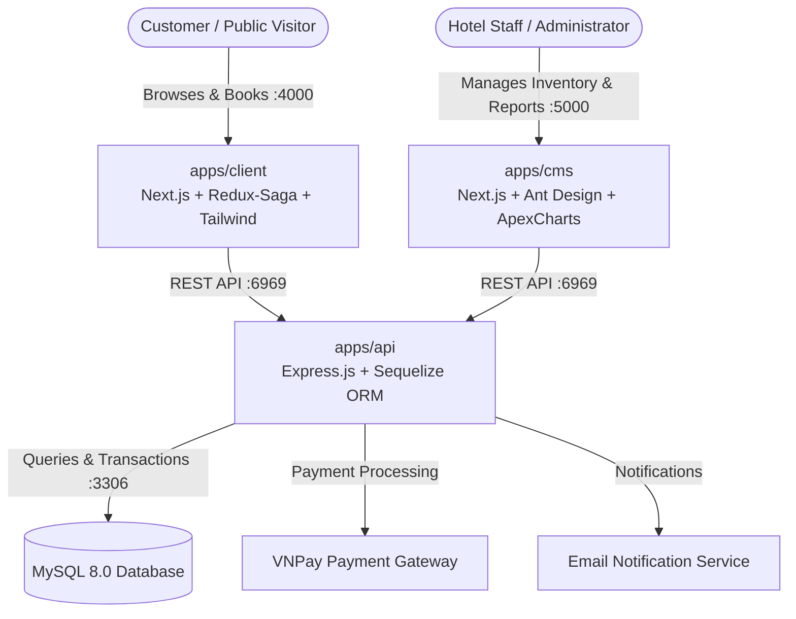

# DATPHONG.COM — Hotel Booking & Management Monorepo

[](https://github.com/hoangnguyen3/datn/actions/workflows/ci.yml)
[](https://github.com/hoangnguyen3/datn/releases)
[](https://nodejs.org/)
[](https://pnpm.io/)
[](https://turbo.build/repo)
[](https://nextjs.org/)
[](https://expressjs.com/)
[](https://www.mysql.com/)

An enterprise-grade, end-to-end hotel booking and administration platform built as a high-performance monorepo using **Turborepo** and **pnpm workspaces**. DATPHONG.COM streamlines hotel inventory management, multi-room reservation workflows, real-time availability checks, secure VNPay payment gateway transactions, and executive business analytics.

---

## Architecture Overview

The platform uses a decoupled micro-frontend and monolithic backend service pattern orchestrated within a unified repository workspace.



---

## Services & Port Mapping

| Service           | Path          | Technology Stack                                              | Port   | Purpose                                                          |
| ----------------- | ------------- | ------------------------------------------------------------- | ------ | ---------------------------------------------------------------- |
| **Client Portal** | `apps/client` | Next.js 13, Redux Toolkit, Redux-Saga, Tailwind CSS, AntD     | `4000` | Customer hotel search, room reservation, and payment portal      |
| **Admin CMS**     | `apps/cms`    | Next.js 13, Redux Toolkit, Redux-Saga, Ant Design, ApexCharts | `5000` | Room & category management, booking approvals, revenue analytics |
| **Backend API**   | `apps/api`    | Node.js, Express.js, Sequelize ORM, JWT, VNPay SDK            | `6969` | Authentication, business logic, transactions, and REST endpoints |
| **Database**      | Docker        | MySQL 8.0                                                     | `3306` | Relational data store for bookings, users, rooms, and payments   |

---

## Quickstart

### Option 1: One-Command Start with Docker Compose

Run the entire stack including database, API, customer portal, and admin portal:

```bash
docker compose up -d
```

Access services:

- Client Portal: [http://localhost:4000](http://localhost:4000)
- Admin CMS: [http://localhost:5000](http://localhost:5000)
- Backend API: [http://localhost:6969](http://localhost:6969)
- MySQL Database: `localhost:3306`

To shut down all containers and networks:

```bash
docker compose down
```

---

### Option 2: Local Development with pnpm & Turborepo

#### Prerequisites

- Node.js >= 18.0.0
- pnpm >= 9.0.0
- Running MySQL instance on port 3306 (or start only MySQL via `docker compose up -d mysql`)

#### 1. Clone & Install Dependencies

```bash
git clone https://github.com/hoangnguyen3/datn.git
cd datn
pnpm install
```

#### 2. Database Migration and Seeding

Ensure MySQL is running with database `datn` created, then apply schema migrations and initial seed records:

```bash
cd apps/api
npx sequelize-cli db:migrate
npx sequelize-cli db:seed:all
cd ../..
```

#### 3. Run Development Servers

Run all applications concurrently with Turborepo:

```bash
pnpm dev
```

Or target individual applications:

```bash
pnpm dev:api     # Start Express API server (:6969)
pnpm dev:client  # Start Client web app (:4000)
pnpm dev:cms     # Start Admin CMS (:5000)
```

---

## Monorepo Command Reference

All workspace pipelines are managed via Turborepo:

| Command           | Action                                                                |
| ----------------- | --------------------------------------------------------------------- |
| `pnpm dev`        | Run all applications concurrently in watch/development mode           |
| `pnpm dev:api`    | Run only the Express backend API service                              |
| `pnpm dev:client` | Run only the customer-facing client application                       |
| `pnpm dev:cms`    | Run only the admin CMS portal                                         |
| `pnpm build`      | Compile and build all applications using cached pipeline dependencies |
| `pnpm lint`       | Run ESLint across all workspace packages                              |
| `pnpm format`     | Run Prettier code formatting on all files                             |

---

## Automated Releases & Conventional Commits

This monorepo utilizes **Google Release-Please** to automate Semantic Versioning and changelog generation. Commits pushed to `main` evaluate commit messages to open release PRs automatically.

### Conventional Commit Conventions

| Prefix             | Release Impact  | Purpose                                  | Example                                                  |
| ------------------ | --------------- | ---------------------------------------- | -------------------------------------------------------- |
| `feat:`            | Minor (`0.x.0`) | New feature or capability                | `feat: add VNPay QR code payment handler`                |
| `fix:`             | Patch (`0.0.x`) | Bug fix                                  | `fix: resolve room availability date overlap validation` |
| `perf:`            | Patch (`0.0.x`) | Performance optimization                 | `perf: cache room query results with Redis`              |
| `docs:`            | None            | Documentation updates                    | `docs: update API endpoint reference in README`          |
| `refactor:`        | None / Patch    | Code refactoring without behavior change | `refactor: extract booking calculation utility`          |
| `chore:`           | None            | Dependency bumps or maintenance tasks    | `chore: upgrade turbo to latest version`                 |
| `BREAKING CHANGE:` | Major (`x.0.0`) | Incompatible API changes                 | `feat!: remove legacy booking v1 endpoints`              |

---

## Screenshots & Demo

### Customer Booking Portal (`apps/client`)

<!-- Replace with production or demo screenshots -->

```
+-----------------------------------------------------------------------+
|  DATPHONG.COM - Find & Reserve Luxury Hotel Rooms                     |
|  [ Destination ] [ Check-in / Check-out ] [ Guests ] [ Search Rooms ]|
|                                                                       |
|  [ Room Card: Deluxe Suite ]     [ Room Card: Executive Ocean View ]  |
|  - King Bed, City View           - Balcony, Jacuzzi                   |
|  - $150 / night                  - $280 / night                       |
|  [ Book Now ]                    [ Book Now ]                         |
+-----------------------------------------------------------------------+
```

### Admin Management Dashboard (`apps/cms`)

<!-- Replace with production or demo screenshots -->

```
+-----------------------------------------------------------------------+
|  DATPHONG CMS - Management Portal                                     |
|  [ Overview ] [ Bookings ] [ Rooms ] [ Categories ] [ Analytics ]     |
|                                                                       |
|  Total Revenue: $45,280 | Total Bookings: 328 | Occupancy Rate: 84%   |
|  [ ApexCharts: Monthly Revenue & Booking Trends Area Graph ]         |
+-----------------------------------------------------------------------+
```

---

## License

This project is licensed under the MIT License - see the LICENSE file for details.
